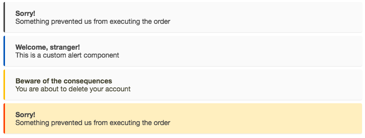

# Alerts

Display an array of informative messages to end-user.

Each alert has a heading, content and a type.



## Demo & Examples

Live demo: [thevangelist.github.io/react-simple-alerts](http://thevangelist.github.io/react-simple-alerts/)

To build the examples locally, run:

```
npm install
npm start
```

Then open [`localhost:8000`](http://localhost:8000) in a browser.


## Installation

The easiest way to use react-simple-alerts is to install it from NPM and include it in your own React build process (using [Browserify](http://browserify.org), [Webpack](http://webpack.github.io/), etc).

You can also use the standalone build by including `dist/react-simple-alerts.js` in your page. If you use this, make sure you have already included React, and it is available as a global variable.

```
npm install react-simple-alerts --save
```


## Usage

Provide an array of alerts containing objects like this:

```
var Alerts = require('react-simple-alerts');

const items = [
	{
		heading: 'Welcome, stranger!',
		content: 'This is a custom alert component',
		type: 'info'
	},
	{
		heading: 'Beware of the consequences',
		content: 'You are about to delete your account',
		type: 'warning'
	},
	{
		heading: 'Sorry!',
		content: 'Something prevented us from executing the order',
		type: 'error'
	}
];

<Alerts items={items} />
```

### Properties

**items (*array*)**
The array of messages each composed of:

**heading (*string*, required)**
Heading text of the message

**content (*string*, optional)**
Content which further explains the title

**type (*string*, optional)**
("info"|"warning"|"error"|"")


### Notes

Change the type (looks) of an alert by providing the type to each alert.

## Development (`src`, `lib` and the build process)

**NOTE:** The source code for the component is in `src`. A transpiled CommonJS version (generated with Babel) is available in `lib` for use with node.js, browserify and webpack. A UMD bundle is also built to `dist`, which can be included without the need for any build system.

To build, watch and serve the examples (which will also watch the component source), run `npm start`. If you just want to watch changes to `src` and rebuild `lib`, run `npm run watch` (this is useful if you are working with `npm link`).

## License

ISC License

Copyright (c) 2016 Esa Juhana Lahikainen.

Permission to use, copy, modify, and/or distribute this software for any purpose with or without fee is hereby granted, provided that the above copyright notice and this permission notice appear in all copies.
THE SOFTWARE IS PROVIDED "AS IS" AND THE AUTHOR DISCLAIMS ALL WARRANTIES WITH REGARD TO THIS SOFTWARE INCLUDING ALL IMPLIED WARRANTIES OF MERCHANTABILITY AND FITNESS. IN NO EVENT SHALL THE AUTHOR BE LIABLE FOR ANY SPECIAL, DIRECT, INDIRECT, OR CONSEQUENTIAL DAMAGES OR ANY DAMAGES WHATSOEVER RESULTING FROM LOSS OF USE, DATA OR PROFITS, WHETHER IN AN ACTION OF CONTRACT, NEGLIGENCE OR OTHER TORTIOUS ACTION, ARISING OUT OF OR IN CONNECTION WITH THE USE OR PERFORMANCE OF THIS SOFTWARE.
